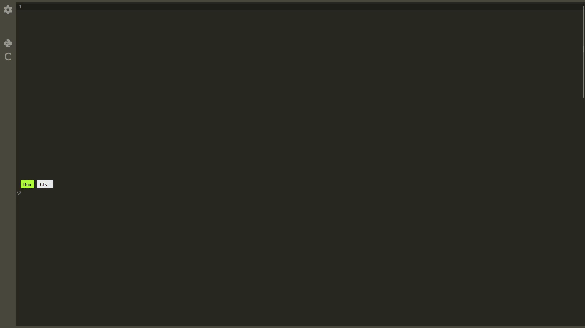

# code-playground
> Online Compiler made with Docker containers.

## Overview
This project is designed to allow users to write, compile, and execute code in various programming languages directly from their web browser. Its primary goal was to learn more about Docker containers and how a simple remote code execution platform could be created.

## Preview

    

## How it works
To enable users to interact with their programs and receive compilation or runtime errors, this application utilizes WebSocket communication. This communication is based on commands that the client can send to the WebSocket consumer, such as:

- Start/Stop Code Execution
- Send Input to the Executing Program

On the backend, each request for code execution results in the creation of a new Docker container from a predefined image (with a separate image for each supported language). Each container has its own handler that tracks its status (e.g., starting, executing, or stopped). The container's output is sent back to the user who initiated the code execution via WebSocket (using a callback mechanism).
Additionally, there is a control thread that terminates containers exceeding the allowed execution time. If the number of running containers exceeds the limit, new code execution requests are placed in a queue until resources become available.

    Currently, the Docker containers are running without additional isolation layers.To make this actually somewhat secure i would run Docker inside <a href="https://github.com/google/gvisor">gVisor</a>.

## Key points
- Integrated IDE
- Live Code Execution (input,output,runtime/compilation errors)
- WebSocket Communication
- Container Quantity limitation with queue
- Container Execution Time limitation

## License
<h5>MIT</h5>
